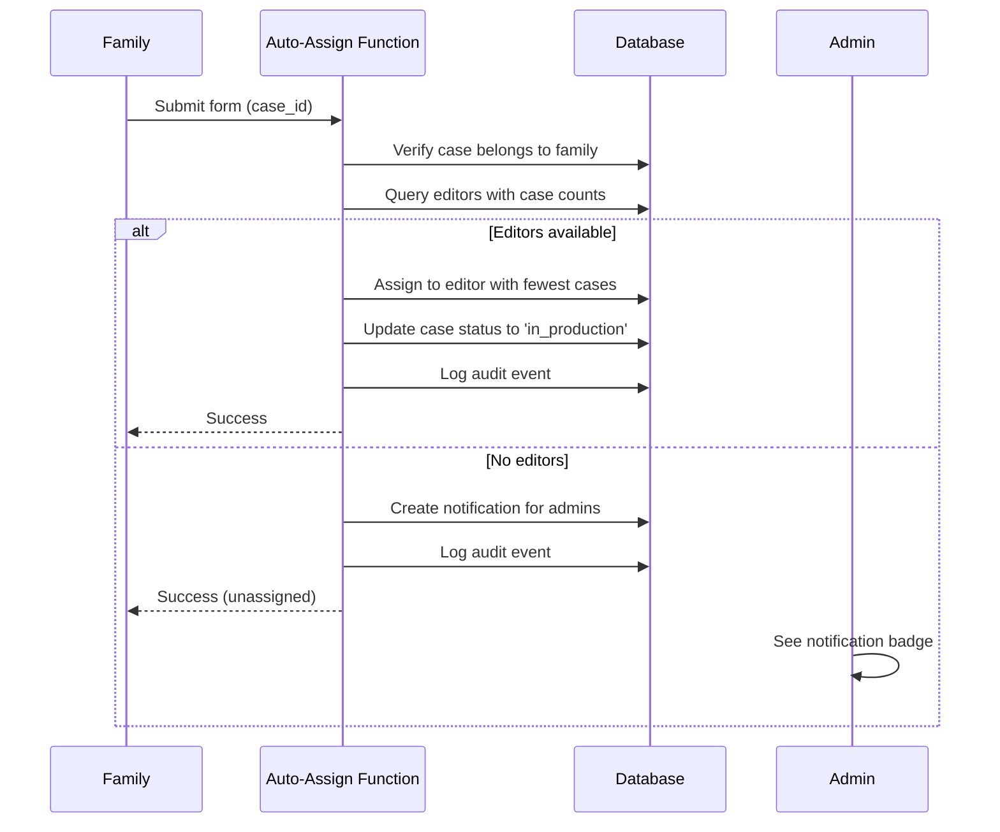

# Auto-Assign Editor Feature - Deployment Guide

## 🚀 Quick Start

The auto-assign editor feature has been fully implemented and committed. Follow these steps to deploy and test it.

## 📋 What Was Built

### 1. **Edge Function: `auto-assign-editor`**
- Automatically assigns editors to cases when families submit forms
- Load balancing: assigns to editor with fewest active cases
- Fallback: notifies admins if no editors available
- Security: RLS enforced, verifies family owns case

### 2. **Family Portal Integration**
- Auto-assign triggered after successful form submission
- Non-blocking (doesn't affect obituary generation)
- Console logs for debugging

### 3. **Admin Portal Notifications**
- Red badge on "All Cases" nav link (shows count of unassigned cases)
- Alert box on dashboard with case details
- Lists cases that couldn't be auto-assigned

---

## 🔧 Deployment Steps

### Step 1: Deploy the Edge Function

```bash
# Make sure you're in the project directory
cd /Users/mejrifx/Downloads/memorio-ai

# Login to Supabase (if not already logged in)
supabase login

# Link to your project (if not already linked)
supabase link --project-ref YOUR_PROJECT_REF

# Deploy the auto-assign-editor function
supabase functions deploy auto-assign-editor

# Verify deployment
supabase functions list
```

**Expected Output:**
```
auto-assign-editor (deployed)
```

### Step 2: Verify Edge Function Permissions

The Edge Function needs these permissions (already configured):
- ✅ Read access to `users` table (to query editors)
- ✅ Read access to `cases` table (to verify case ownership)
- ✅ Read access to `editor_assignments` table (to count active cases)
- ✅ Write access to `editor_assignments` table (to create assignments)
- ✅ Write access to `cases` table (to update status)
- ✅ Write access to `notifications` table (to create admin alerts)
- ✅ Write access to `events` table (to log audit events)

**Note:** The function uses the service role key, so it bypasses RLS for querying editors.

### Step 3: Test the Deployment

1. **Create Test Editors:**
   - Go to Admin Portal → Invite Editor
   - Create 2-3 test editor accounts

2. **Submit a Test Form:**
   - Log in as a family user
   - Complete and submit the intake form
   - Open browser console and look for:
     ```
     🤖 Auto-assigning editor to case...
     ✅ Editor auto-assigned: [editor name]
     ```

3. **Verify in Admin Portal:**
   - Go to Admin Portal → All Cases
   - Case should appear in "In Progress" column
   - Case status should be `in_production`

4. **Test No Editors Scenario:**
   - Suspend all editor accounts
   - Submit a family form
   - Console should show: `⚠️ No editors available - admin notified`
   - Admin dashboard should show notification badge
   - Alert box should list the unassigned case

---

## 🧪 Testing Checklist

Use the comprehensive testing guide: [`TESTING-AUTO-ASSIGN-EDITOR.md`](TESTING-AUTO-ASSIGN-EDITOR.md)

**Quick Test:**
- [ ] Deploy Edge Function successfully
- [ ] Create 2 editors (Editor A: 0 cases, Editor B: 1 case)
- [ ] Submit family form → should assign to Editor A
- [ ] Verify case in "In Progress" in admin portal
- [ ] Delete all editors
- [ ] Submit another form → admin notification appears

---

## 📊 Monitoring

### Check Edge Function Logs
```bash
# View real-time logs
supabase functions logs auto-assign-editor --tail

# View recent logs
supabase functions logs auto-assign-editor --limit 100
```

### Check Database State
```sql
-- View editor workloads
SELECT 
  u.email,
  u.status,
  COUNT(ea.id) as active_cases
FROM users u
LEFT JOIN editor_assignments ea 
  ON ea.editor_user_id = u.id 
  AND ea.unassigned_at IS NULL
WHERE u.role = 'editor'
GROUP BY u.id, u.email, u.status
ORDER BY active_cases ASC;

-- View recent auto-assignments
SELECT * FROM events
WHERE action_type = 'AUTO_ASSIGN_EDITOR'
ORDER BY timestamp DESC
LIMIT 10;

-- View pending notifications
SELECT * FROM notifications
WHERE event_type = 'no_editors_available'
AND status = 'pending'
ORDER BY created_at DESC;
```

---

## 🔒 Security Features

✅ **Authentication Required:** Only authenticated family users can call the function
✅ **Case Ownership Verified:** Family user must own the case they're assigning
✅ **RLS Enforced:** All database operations respect Row Level Security
✅ **Audit Logging:** All assignments logged in `events` table
✅ **Service Role Key:** Used for editor queries (bypasses RLS safely)

---

## 🎯 How It Works



---

## 🛠️ Troubleshooting

### Issue: "Function not found" error
**Solution:** Redeploy the function
```bash
supabase functions deploy auto-assign-editor
```

### Issue: "Unauthorized" error
**Solution:** Check that family user is logged in and session is valid

### Issue: Editor not being assigned
**Solution:** 
1. Check editor status is 'active' or 'invited'
2. Check Edge Function logs: `supabase functions logs auto-assign-editor --tail`
3. Verify editors exist: `SELECT * FROM users WHERE role = 'editor'`

### Issue: Notification badge not showing
**Solution:** Hard refresh admin portal (Cmd/Ctrl + Shift + R)

---

## 🔄 Rollback Plan (If Needed)

If you need to disable the feature temporarily:

1. **Disable auto-assignment in family portal:**
   - Comment out the `await autoAssignEditor(currentCase.id);` line in `index.html`
   - Redeploy the site

2. **Keep manual assignment working:**
   - Manual assignment in admin portal is unaffected
   - Cases can still be assigned manually

---

## 📈 Next Steps (Optional Enhancements)

Future improvements you could add:

1. **Email notifications to admins** when no editors available
2. **Editor availability status** (online/offline, vacation mode)
3. **Skill-based assignment** (assign based on editor specialization)
4. **Workload limits** (max cases per editor)
5. **Priority assignment** (urgent cases get assigned first)
6. **Reassignment on timeout** (auto-reassign if editor doesn't start within X hours)

---

## ✅ Deployment Checklist

- [ ] Edge Function deployed successfully
- [ ] Function appears in `supabase functions list`
- [ ] Test assignment with multiple editors (different loads)
- [ ] Test assignment with no editors (admin notification)
- [ ] Verify notification badge appears in admin portal
- [ ] Check Edge Function logs for errors
- [ ] Verify RLS security (unauthorized attempts blocked)
- [ ] Test concurrent form submissions
- [ ] Document deployment date and version in internal notes

---

## 📞 Support

If you encounter issues:
1. Check Edge Function logs: `supabase functions logs auto-assign-editor --tail`
2. Check browser console for errors
3. Verify database state using SQL queries above
4. Review `TESTING-AUTO-ASSIGN-EDITOR.md` for specific test scenarios

---

**Deployment Date:** Ready to deploy
**Version:** 1.0.0
**Status:** ✅ Implemented and committed

